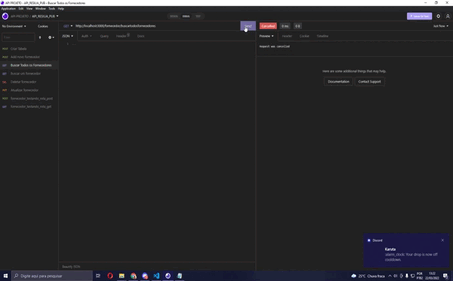

# Resilia Pub - API

O Resilia-PUB é uma API Rest de gerenciamento de PUBS construída em colaboração com [@ArcenioSouza](https://github.com/ArcenioSouza), [@Hugo Parada](https://github.com/haparada9), [@Milena Souza](https://github.com/Milena2712) e [@Gicelle Sena](https://github.com/Gicelle-sena). Cada colaborador ficou responsável por criar uma instância do banco de dados da API e posteriormente iremos usar os conhecimentos obtidos para juntarmos todas as instâncias e criar os seus relacionamentos. Com essa aplicação você será capaz de salvar, atualizar, pesquisar e deletar registros dos fornecedores do PUB. 

# Ferramentas utilizadas

<div>
   
   
   
   
   
   
   
</div>

# Como utilizar a aplicação

### **1 - Faça o clone do repositório**

Para fazer o clone desse repositório basta copiar o código abaixo e colar em seu terminal.
```
git clone https://github.com/MatheusCamba/Resilia_Pub_API.git
```
### **2 - Instale as dependencias necessárias**

Para realizar a instalação das dependencias necessárias, entre na pasta do projeto, e, no terminal, execute o comando abaixo:
```
npm install
```

### **3 - Execute a aplicação**

Para executar a aplicação basta executar o comando abaixo em seu terminal.
```
npm start
```

O package.json deve conter as seguintes dependências:
```
 "dependencies": {
    "express": "^4.17.3",
    "path": "^0.12.7",
    "sqlite3": "^5.0.2",
    "url": "^0.11.0"
  },
  "devDependencies": {
    "nodemon": "^2.0.15"
  },
  "type": "module"
```

A instalação do nodemon, para evitar problemas, é melhor ser feita nas devDependencies com o seguinte código no terminal:
```
npm install --save-dev nodemon
```

**Observação:** Essa aplicação será executada por padrão na porta 3000 do seu localHost, caso essa porta esteja sendo utilizada por outra aplicação basta mudar o valor da variável 'port' do arquivo 'app.js' para um valor de porta disponível em seu sistema.

# Rotas da API
Essa aplicação possui um conjunto de rotas que torna possível o uso de todos os verbos HTTP necessários para a realização do CRUD. Além disso você pode utilizar essa API remotamente através da seguinte url hospedada no servidor do Heroku: `https://resilia-api-pub.herokuapp.com/`

### **1 - Salvar as informações de um fornecedor**

Para salvar um fornecedor na API é usado o método HTTP `POST` no caminho `url da Api + /fornecedor/novofornecedor`

Deverá ser passado no corpo da requisição as informações do novo fornecedor em formato JSON, segundo o modelo e propriedades abaixo:
```
{
	"nome":"José Pastéis",
	"cnpj":15522424242455,
	"telefone":2155554444
}
``` 
### **2 - Buscar todos os fornecedores**

Utilizando o método HTTP `GET` no caminho `url da Api + /fornecedor/buscartodosfornecedores`


### **3 - Buscar apenas um fornecedor**

Para essa busca, além de utilizamos o metodo HTTP `GET`, devemos especificar na url um ID específico, no caminho `url da Api + /fornecedor/buscarumfornecedor/:id`

O ID será passado como um parâmetro na rota, como no exemplo abaixo.
```
http://localhost:3000/fornecedor/buscarumfornecedor/2
```
Desse modo a API retornará os dados do fornecedor com o ID indicado.

### **4 - Deletar um fornecedor**

Para deletar um fornecedor utilizamos o método HTTP `DELETE` no caminho `url da Api + /fornecedor/deletarfornecedor/:id`

Na requisição deverá ser passado o ID do fornecedor que deseja deletar, do mesmo modo supracitado.
```
http://localhost:3000/fornecedor/deletarfornecedor/2
```

### **5 - Atualizar as informações de um fornecedor**

Para atualizar as informações de um fornecedor na API é usado o método HTTP `PUT` no caminho `url da Api + /fornecedor/atualizarfornecedor/:id`

Devemos passar um ID como parâmetro, para especificar o fornecedor que queremos atualizar, e, no corpo da requsição, as informações do fornecedor em formato JSON, segundo o modelo e propriedades abaixo:
```
{
	"nome": "Empresa de Comidas",
	"cnpj": 15442366887554,
	"telefone": 2155477586
}
```
# **Usando a API**
<h1 align="center">
    
</h1>